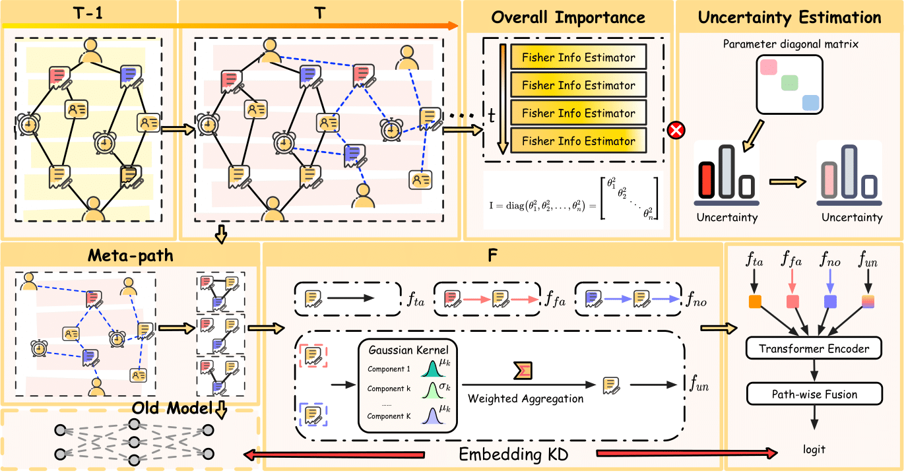

# When Fraud Evolves: Towards Open-World Financial Fraud Detection via Incremental Uncertainty Estimation

This repository contains the complete code implementation for the paper “When Fraud Evolves: Towards Open-World Financial Fraud Detection via Incremental Uncertainty Estimation.”



## 📂File Structure
```text
.
├── GraphUpdate.py    # Graph structure incremental update module
├── main.py           # Main entry point: training & testing pipeline
├── model.py          # Model definitions: Group-wise Message Passing and core networks
├── KD.py             # Distance metric functions (for knowledge distillation, etc.)
├── utils.py          # General utility functions (data processing, evaluation metrics, etc.)
├── args.py           # Hyperparameter configuration and parsing
├── Supplementary Experiment.md  # The file Supplementary Experiment.md contains the additional experiments we conducted in response to the reviewers’ questions.
└── data/             # Stores datasets (e.g., CCT, Vesta, Amazon2023)
```

## Environment Dependencies

- Python== `3.8.10`  
- pandas== `2.0.3`  
- numpy== `1.24.3`  
- DGL (with CUDA 11.6 support)== `1.1.2+cu116`  
- PyTorch:==`1.13.0`  
- scikit-learn:==`1.1.2`  

You can quickly install all dependencies with:

```bash
pip install pandas==2.0.3 numpy==1.24.3 scikit-learn==1.1.2 \
            torch==1.13.0 dgl==1.1.2+cu116
```

## Usage
Run an example (using CCT as an example):

```bash
python main.py --dataset CCT --alpha 0.5 --beta 1.0
```

This example demonstrates the open-world pipeline on the CCT dataset. The procedure is:
1. run main.py to parse hyperparameters and load the dataset;
2. initialize the model and train/evaluate the initial task within main;
3. perform heterogeneous graph evolution by invoking the key functions in GraphUpdate.py;
4. after evolution, extract the subgraph for the current time window (slot) and call Refine in main.py to conduct replay-free training;
5. repeat steps 3–4 until all slots have been processed.
